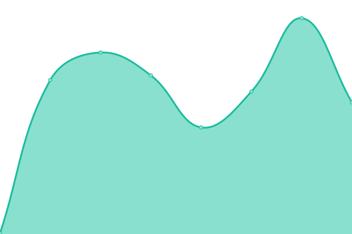
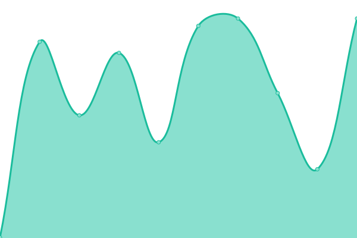
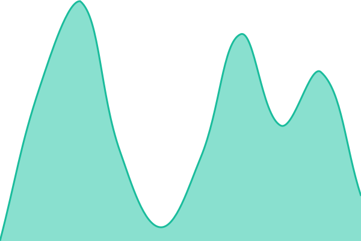

# [📈 Live Status](https://jmitz.github.io/upTime): <!--live status--> **🟧 Partial outage**

This repository contains the open-source uptime monitor and status page for [Jeff Mitzelfelt](https://jmitz.github.io/upTime), powered by [Upptime](https://github.com/upptime/upptime).

With [Upptime](https://upptime.js.org), you can get your own unlimited and free uptime monitor and status page, powered entirely by a GitHub repository. We use [Issues](https://github.com/jmitz/upTime/issues) as incident reports, [Actions](https://github.com/jmitz/upTime/actions) as uptime monitors, and [Pages](https://jmitz.github.io/upTime) for the status page.

<!--start: status pages-->
<!-- This summary is generated by Upptime (https://github.com/upptime/upptime) -->
<!-- Do not edit this manually, your changes will be overwritten -->
<!-- prettier-ignore -->
| URL | Status | History | Response Time | Uptime |
| --- | ------ | ------- | ------------- | ------ |
|  [Tremont Gallery](http://www.tremontgallery.com) | 🟩 Up | [tremont-gallery.yml](https://github.com/jmitz/upTime/commits/HEAD/history/tremont-gallery.yml) | 

 237ms
     
 | 

<a href="https://jmitz.github.io/upTime/history/tremont-gallery">100.00%</a>
    

|  [Yellowstone Research](http://gyccscience.org) | 🟩 Up | [yellowstone-research.yml](https://github.com/jmitz/upTime/commits/HEAD/history/yellowstone-research.yml) | 

 293ms
     
 | 

<a href="https://jmitz.github.io/upTime/history/yellowstone-research">100.00%</a>
    

|  [Peoria SDA](http://peoriasda.org) | 🟩 Up | [peoria-sda.yml](https://github.com/jmitz/upTime/commits/HEAD/history/peoria-sda.yml) | 

 888ms
     
 | 

<a href="https://jmitz.github.io/upTime/history/peoria-sda">100.00%</a>
    

|  [JustBee](https://shop.justbee.us/) | 🟥 Down | [just-bee.yml](https://github.com/jmitz/upTime/commits/HEAD/history/just-bee.yml) | 

 438ms
     
 | 

<a href="https://jmitz.github.io/upTime/history/just-bee">99.53%</a>
    

<!--end: status pages-->

[**Visit our status website →**](https://jmitz.github.io/upTime)

## 📄 License

- Code: [MIT](./LICENSE) © [Jeff Mitzelfelt](https://jmitz.github.io/upTime)
- Data in the `./history` directory: [Open Database License](https://opendatacommons.org/licenses/odbl/1-0/)
