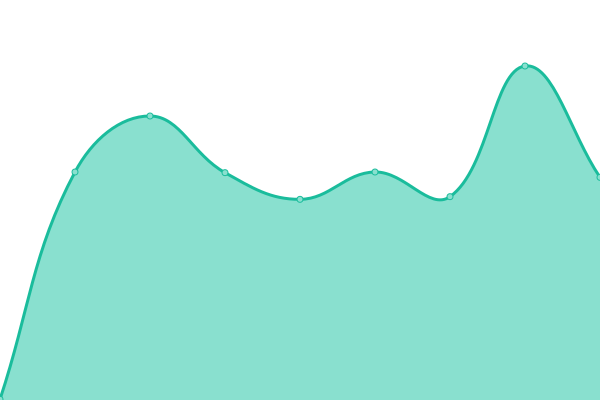
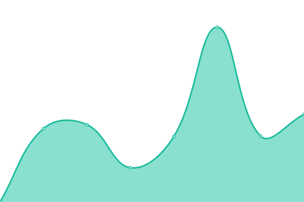
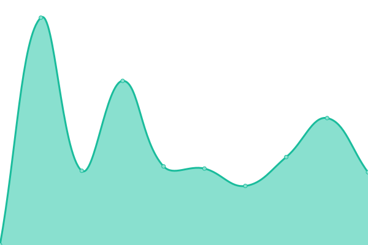

# [📈 Live Status](https://jmitz.github.io/upTime): <!--live status--> **🟩 All systems operational**

This repository contains the open-source uptime monitor and status page for [Jeff Mitzelfelt](https://jmitz.github.io/upTime), powered by [Upptime](https://github.com/upptime/upptime).

With [Upptime](https://upptime.js.org), you can get your own unlimited and free uptime monitor and status page, powered entirely by a GitHub repository. We use [Issues](https://github.com/jmitz/upTime/issues) as incident reports, [Actions](https://github.com/jmitz/upTime/actions) as uptime monitors, and [Pages](https://jmitz.github.io/upTime) for the status page.

<!--start: status pages-->
<!-- This summary is generated by Upptime (https://github.com/upptime/upptime) -->
<!-- Do not edit this manually, your changes will be overwritten -->

| URL                                                   | Status | History                                                                                                     | Response Time                                                                             | Uptime                                                                                                                                                                                                                            |
| ----------------------------------------------------- | ------ | ----------------------------------------------------------------------------------------------------------- | ----------------------------------------------------------------------------------------- | --------------------------------------------------------------------------------------------------------------------------------------------------------------------------------------------------------------------------------- |
| [Tremont Gallery](http://www.tremontgallery.com)      | 🟩 Up  | [tremont-gallery.yml](https://github.com/jmitz/upTime/commits/master/history/tremont-gallery.yml)           |  287ms      |            |
| [Yellowstone Research](http://yellowstone.jdmitz.com) | 🟩 Up  | [yellowstone-research.yml](https://github.com/jmitz/upTime/commits/master/history/yellowstone-research.yml) |  216ms |  |
| [Peoria SDA](http://peoriasda.org)                    | 🟩 Up  | [peoria-sda.yml](https://github.com/jmitz/upTime/commits/master/history/peoria-sda.yml)                     |  1989ms          |                      |
| [JustBee](https://shop.justbee.us/)                   | 🟩 Up  | [just-bee.yml](https://github.com/jmitz/upTime/commits/master/history/just-bee.yml)                         |  337ms             |                         |

<!--end: status pages-->

[**Visit our status website →**](https://jmitz.github.io/upTime)

## 📄 License

- Code: [MIT](./LICENSE) © [Jeff Mitzelfelt](https://jmitz.github.io/upTime)
- Data in the `./history` directory: [Open Database License](https://opendatacommons.org/licenses/odbl/1-0/)
